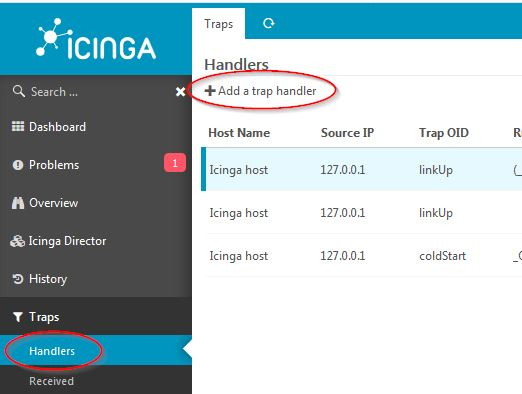
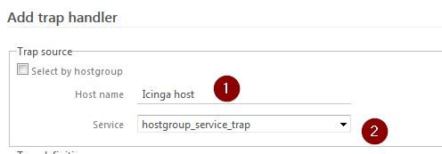
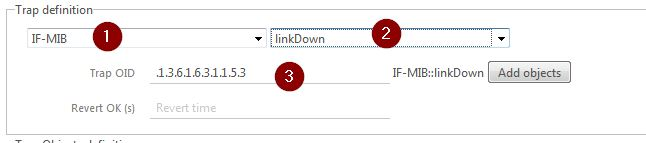

Create rule
===============

The easy way to create rule is with an existing trap, but you also can create a rule before receiving any traps.

Create trap
---------------

Go to the Handlers menu and click 'Add a trap handler'.

You can choose between hosts or hostgroups:
- When selecting a host, the trap receiver will take it's source IP
- When selecting a hostgroup, the trap receiver will take all IP addresses of all hosts in this hostgroup (! performance issues (maybe) !)

In both cases, you must have a service attached to the host or hostgroup that accepts passive checks (see  for more info)

Now first, (1) select host/group name (autocompletion provided)

Then select a service (2). The service list is from the IDO database.

Then you can either:
* Manually add the trap OID  (3) (you won't be able to add objects automatically)
* Or, select the MIB (1) then the trap name in this MIB (2).

In the second case, the "Add objects" button will be enabled. This will add all objects that can be sent with the trap according to the MIB.

The "Revert OK" is the time after which the service will be reset to OK. To do this, you have to set up a specific service on the icinga host (DOC TODO).

Automatic reset can also be done with icinga freshness check / active checks see [here](15-mib.md) for more info).

Objects, rule & display
---------------

See [traps](05-traps.md) documentation.
Then click Create. The rule is created and applied directly.

Go back to the [user guide](02-userguide.md).
