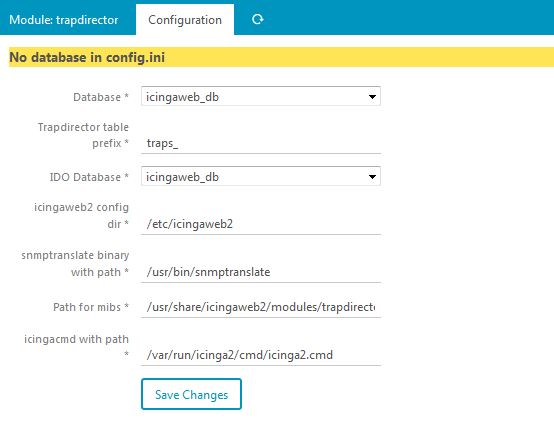

Installation
===============

Requirements
---------------

* Icingaweb2 and php7
* net-snmp for snmptrapd
* net-snmp-utils for snmptranslate
* mysql/mariadb database

Better with
---------------

* Director : to set up services, templates (not implement right now).

Install files
---------------

1. Download latest release and unzip in a temporary directory.
2. Move the 'trapdirector' directory to the /usr/share/icingaweb2/modules directory
3. trapdirector/mibs/ must be writable by icinga web user to upload mibs from web GUI

Activate module
---------------

Log in to icingaweb2 go to Configuration -> modules  and activate the trapdirector modules

Go to the configuration tab, it should look like this : 

Set up a new (or use existing) database in icingaweb 2 (see installation instructions at the bottom of the Configuration page)

The options are

* Database : the DB where traps will be stored
* Prefix : the prefix for all database tables
* IDO Database : the IDO database set up with IcingaWeb2
* Icingaweb2 config dir : configuration directory in case of uncommon installation of icingaweb2
* snmptranslate binary : default should be OK
* Path for mibs : must include net-snmp standard mibs (in /usr/share/snmp/mibs by default) and local mibs (in /usr/share/icingaweb2/modules/trapdirector/mibs)
The value by default should be OK)
* icingacmd path : default should be OK

Create schema
---------------

After setting the database (1) and ido database (2), refresh the config page : 

Click on (3) to create schema

Then go back to module configuration, database should be OK :

Snmptrapd configuration
------------------------

Now, you must tell snmptrapd to send all traps to the module.

Edit the /etc/snmp/snmptrapd file and add : 

* traphandle default /opt/rh/rh-php71/root/usr/sbin/php-fpm /usr/share/icingaweb2/modules/trapdirector/bin/trap_in.php 

Note : on bottom of configuration page, you will have the php and module directories adapted to your system

Set up the community (still in snmptrapd.conf) : here with "public" 

* authCommunity log,execute,net public

With a v3 user :

* createUser -e 0x8000000001020304 trapuser SHA "UserPassword" AES "EncryptionKey"
* authUser log,execute,net trapuser 

Enable & start snmptrad service : 

* systemctl enable snmptrapd
* systemctl start snmptrapd

Now all traps received by the system will be redirected to the trapdirector module.

Now have a look at the doc : 
 
