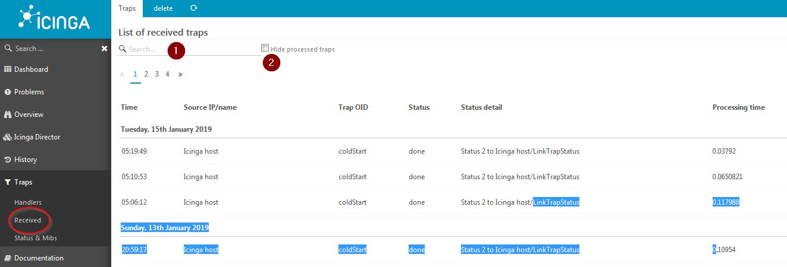
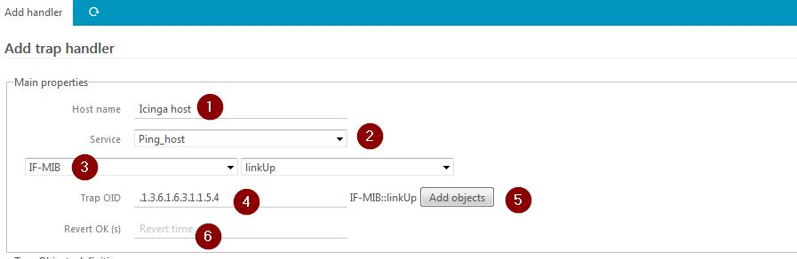
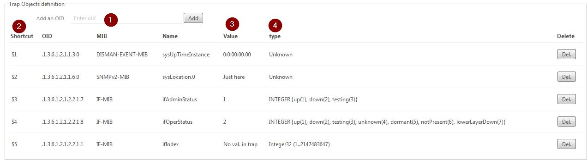
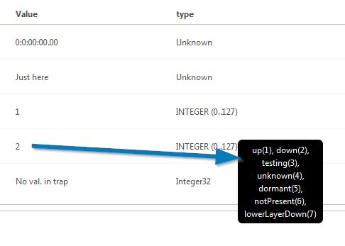
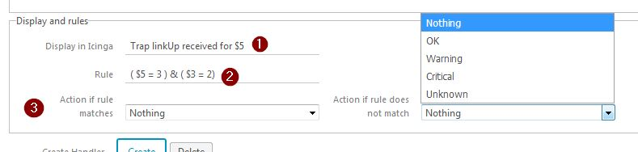

Traps
===============

A little about traps
---------------

In short, a trap is sent by a network node to a trap server (here the icinga host). It contains : 

* Authentication : by a community string in v1 & v2, or a user/password in v3
* The trap OID : an OID (e.g. .1.3.6.1.2.1.1) which defines the trap
* Trap objects : a list of OID with their values, so the system will provide additional information (e.g. interface name).

See here for more info : http://www.net-snmp.org/wiki/

Sending traps for testing
---------------

In the `bin` directory you have 3 shell scripts `test_trap_v(1|2|3).sh` which will send snmp v1, v2 & v3 traps to localhost. You must edit them to configure authentication for your environment. 

Looking at traps received
---------------

Go to Traps -> Received (or just Traps) to see a list of received traps.

1) Filter the display : it will show only traps which include what you typed (will search in IP/OID/status etc..)
2) Click here to hide processed traps : those which matched a rule (see Handlers). 

Click on a trap to see details

Columns : 
* Time the trap was received
* Source IP of trap
* Trap OID (or name if it could be resolved)
* Status : 
	* unknown : no rule was found for this trap
	* done : rule was found and evaluated
	* error : ...
	* waiting : trap was received, but no rule was applied for now
* Processing time : time in seconds taken by the script to process the trap.

Trap details
---------------

Here you have all the information about the trap received :
* 1 : Global information
* 2 : Objects sent with trap and their values
* 3 : Add a handler based on this trap

Click on 'Add a trap handler' : 

Adding a trap handler
---------------
	
The form is divided into four sections

1) Trap source  

* 1 : Icinga host on which the service will be updated
* 2 : Service on which the status will be updated. It must accept passive checks. A template is available in Status & Mibs.
* 3 : If you want your handler to be applied on a hostgroup instead of a host, click here and select a hostgroup and service.

2) Trap definition

* 1 : MIB / trap name to select trap from (auto filled as trap has been recognised)
* 2 : Trap OID
* 3 : If active, this button will add ALL objects that can be set with this trap (as descripbed in it's MIB) in the objects definition below.
* 4 : Time after which the service will be reverted to OK (you can do this here or in the service template).

3) Trap objects definition

This section lists all objects that will be used in the display and rules as $N$ variables.

As you selected a trap, the objects sent with the trap are automaticaly added in here

* 1 : Enter an OID here to manually add objects
* 2 : Shortcuts are $N$ variables that will be used in rules
* 3 : Value sent by the trap selected earlier
* 4 : Type of trap as described in MIB

If you hover on the type values, it will show you specific types meanings, for example : 

So here, the value "2" means interface is "down"

4) Display and rules

Here you can configure : 
* The message displayed in the service when a trap is received (and the rule passes)
* The rule for actions, i.e. set the service state

* 1 : The display string which will be sent along with a status to the service. You can use all the $N$ variables defined above.

Here, the display will be for example : "Trap linkUP received for 3"
(if interface index in object is 3).

* 2 : See [here](08-rules-evaluation.md) for how to make rules.

* 3 : Actions. Depending on whether the rule matches or not. You can choose any common status or 'nothing' to do nothing and 'ignore' to completly ignore the trap (e.g. no database record)

Then click on Create to save and activate your rule for next trap.

Updating a rule
---------------

On the Handler page, click on a rule to edit it.

Testing a rule
---------------

See "Rule testing" in : [Rules evaluation](08-rules-evaluation.md)

Go back to the user guide : [Traps](02-userguide.md)

