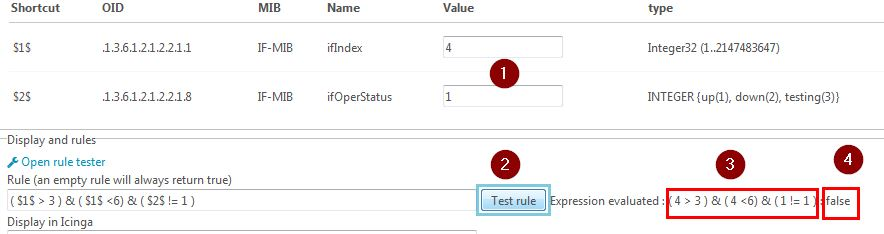
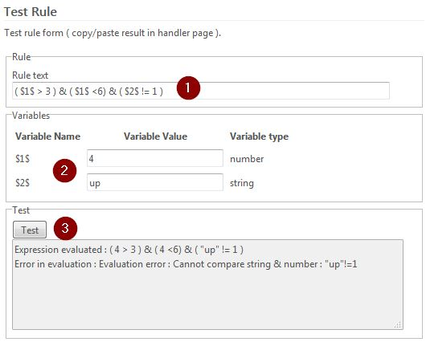

Rules logic and evaluation
==========================

Rule syntax
-----------

Rules are defined using variables, which are in `$<n>$` format.
These variable are substituted with the value in the received trap and the rule is evaluated : each variable is linked with an OID that must be found in the trap data.

Note : 
* An empty rule is always evaluated as "true"
* If an OID is missing in the trap, the evaluation stops and the trap is in "error" state
* Internally, the variables are stored as `_OID(<oid>)`, so one OID does not always the same `$<n>$` variable name as the variable name is only used in creation/update web forms.

OID selection
-------------

In a trap you will find the trap OID and additional informations which will be labeled by OID : see the mib of the trap for full description.

Ex : 
```
.1.3.6.1.2.1.1.6.0 Just here
.1.3.6.1.2.1.2.2.1.7 1
```

So, in this example : _OID(.1.3.6.1.2.1.1.6.0) = "Just here"

If you add these OID manually in the "Trap Objects Definition", you will get `$<n>$` variables to use in rules.


If the OID inside the trap can change, you can use regexp like OID.
For example, if the system location can be .1.3.6.1.2.1.1.6.`1` or .1.3.6.1.2.1.1.6.`2` etc... you can enter .1.3.6.1.2.1.1.6.* :


`*` means 1 number and can be placed anywhere : it is like a [0-9]+ regexp.

- .1.3.*.1.1 will match .1.3.`6`.1.1 or .1.3.`7`.1.1 but NOT .1.3.`6.6.`1

`**` means anything : 

- .1.3.6.1.** will match any OID starting with .1.3.6.1.
- .1.3.6.1.**.5 will match any OID starting with .1.3.6.1. and ending with 5


Writing rules
-------------

* Numbers are written directly : 1 .123  1.123 -5 -8.23
* Any other must have " around : "eth0" "Down" "127.0.0.1"
* To create your own function, have a look here : [API and functions](50-api-functions.md)

Here is an example 


Here the rule "( $1$ > 3 ) & ( $1$ <6) & ( $2$ != 1 )" means : 

If 'ifIndex' greater than 3 AND If 'ifIndex' lower than 6 AND ifOperStatus is not 1 (up)  THEN rule matches

Rule accepts numbers and strings with these operators : < <= > >= = != ~
And the special negate operator : !

Numbers can be used with : < <= > >= = !=
Strings can be used with : = != ~ 

The "~" operator is for regexp : 
* $1$ ~ "test" will be evaluated to true if $1$ contains "test".
* "test" ~ $1$ will be evaluated to true if $1$ is a substring of "test".

You can group with parenthesis and logical operators are : | &

Every OID tested MUST be present in the trap, or it will generate an error - visible in "received" -.

Spaces outside " " are ignored and comparison operators are evaluated before logical ones.

Examples : 

$5$ = 3  &  $3$ = 2 : works, same as the example

$5$ = 3  &  $3$ = 2 | $4$ = 1 : works, evaluated as : $5$ = 3  &  ($3$ = 2 | $4$ = 1 ). Better with parenthesis !

($5$ = "eth0") & ( $3$ = 2) : works as expected

($5$ = "eth0") < $3$ : ERROR

($5$ ~ "eth[0-2]") : will match eth0, eth1 & eth2  (!! it will also match eth11 eth21 !! )

! $5$ = 3 : same as $5$ != 3  , also same as !($5$ = 3)

($5$ = "eth0") & $3$ = 2 : ERROR : can be ambiguous if $3$ is boolean


Testing a rule
---------------

You can test the rule directly in trap handler creation or modification : 



1) Enter or check values of variables (no need to put "" around strings here)
2) Click "test rule"
3) The rule with substituted variables is shown
4) The result : true or false

There is also a rule tester page : click "open rule tester"



1) Enter a rule. Every time you add a "$<n>$" variable, the variables table will extend
2) Enter the values. Variable type is automaticaly calculated and you don't need " " around strings
3) Click 'test' and the result is shown (here an error).


Go back to user guide : [Traps](02-userguide.md)

