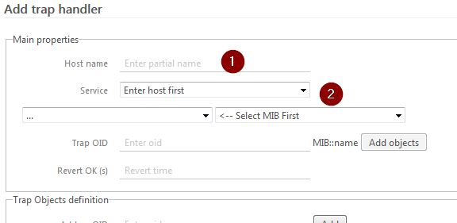
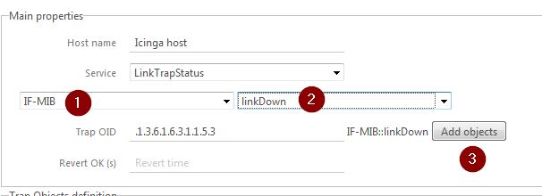
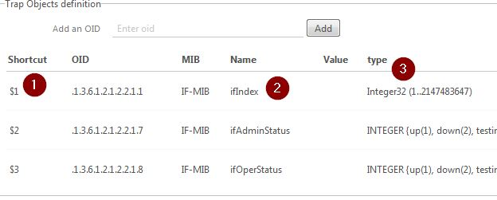
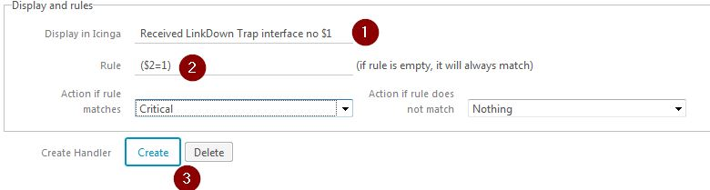

Create rule
===============

The easy way to create rule is with an existing trap, but you also can create a rule before receiving any traps.

Create trap
---------------

Goto Handlers menu and click 'Add a trap handler'

Now first, (1) select host name (autocompletion provided)

Then select a service (2). The service list is get from the IDO database.

Then you can either 

* add manually the trap OID (you won't be able to add objects automaticaly)
* or select the MIB (1) then the trap name in this mib (2).

In the second case, the "Add objects" will be enables : this will add all objects that can be sent with the trap according to the MIB.

The "Revert OK" is the time after which the service will be reseted to OK. To do this, you have to set up a specific service on the icinga host (DOC TODO).

Automatic reset can also be done with icinga freshness check / active checks.

Objects
---------------

Objects can be added directly (see above) or manually with 'Add an OID'

* 1 : Shortcuts $N that will be used in rules
* 2 : Name of trap if it can be resolved
* 4 : Type of trap as described in MIB

Rule and display
---------------

Here you set up display & rules (see  for description)

Then click create : rule is created and applied directly.

