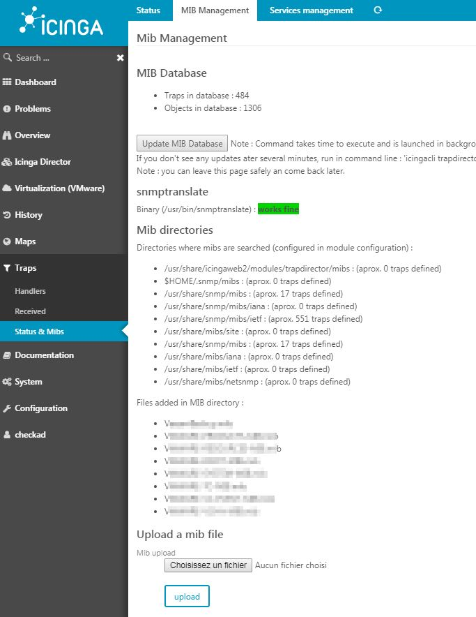

Mib & Status
===============

In the "Status & Mibs" menu, you will set all the configuration for MIBs and database rules.

Status
===============

Database
---------------

Traps are held in the database. You can set the retention period for old traps here.

This will occur every time a trap is received.

To drop some traps manually, you can change the number of days and click "Do it now".

Log destination
---------------

Here is where the trap receiver will log info about what it is doing - or why it is not doing it -.

Note: 'display' is for debug only and can ruin your web page.

Be careful, in trace mode the db passwords & communities can be shown.

MIB Management
===============

MIB Database and management
---------------

The database should hold the SNMP traps definition and their objects, so you can select them easily when creating a rule.

At the bottom of the page, you can upload a MIB file (or put it in the mibs/ directory of module).

The system then needs to scan all MIB files, so it takes some time. You can update here by clicking 'Update MIB Database', or on cli with `icingacli trapdirector mib update`. 

With the cli, you will be able to monitor output. With the GUI, the process will run in the background (it is ok to leave the page), and the button will animate until the process has finished.

snmptranslate
---------------

The system needs `snmptranslate` to parse the MIBs. Here you can check if the configuration of the module is correct, and if `snmptranslate` works fine on your system.

Services management
===============

Not much here for now. You can create a service template for services using traps.

Some details: 

1: the active check is "dummy" which will return OK all the time.

2: check & retry interval is the time your trap will be reverted to "OK", here is how it's working:

- at 08h00 the active check runs and gives "OK". Next check is in 900s (15 min) so at 08h15
- at 08h10 a trap gives a "critical" status to the service. Next check is set to 08h10 + 15 min = 08h25.
- at 08h25 if no traps have been received, the active check runs and returns OK.

3: Need to acept active & passive checks.

Go back to the [user guide](02-userguide.md).
