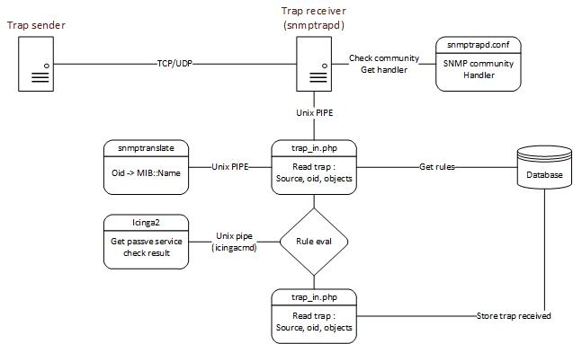

Receiver Logic
===============


General diagram
---------------




Network trap 
---------------

A trap is sent to snmptrapd, it will 

* check snmp community or v3 user : snmptrapd will drop trap with wrong community/user
* send to defined handler as input :

```
UDP: [127.0.0.1]:33025->[127.0.0.1]:162
.1.3.6.1.2.1.1.3.0 0:0:00:00.00
.1.3.6.1.6.3.1.1.4.1.0 .1.3.6.1.6.3.1.1.5.4
.1.3.6.1.2.1.1.6.0 Just here
.1.3.6.1.2.1.2.2.1.7 1
.1.3.6.1.2.1.2.2.1.8 1
```
Here UDP from localhost to localhost
Following lines are traps objects, including the trap oid.

Translated, this trap means : 

```
sysUpTimeInstance	0:0:00:00.00
snmpTrapOID.0		IF-MIB::linkUp
sysLocation.0		Just here
ifAdminStatus		up(1)
ifOperStatus		up(1)
```

trap_in.php
---------------

1) read the trap from stdin

Extracts trap oid and stores objects (OID/value)

2) Get all rules which match ( sourceIP / trapoid )

Evaluate all rules one by one.
If a rule is empty, it will always be true : the "on match" action will by executed

If action is other than 'do nothing' or 'ignore' then send passive service check either

* to icingacmd
example : "[1547221876] PROCESS_SERVICE_CHECK_RESULT;Icinga host;LinkTrapStatus;2;Trap linkUp received at 0:0:00:00.00 from Just here" > /var/run/icinga2/cmd/icinga2.cmd

* using icinga2 API

3) stores trap with status (except if action is 'ignore')
- done : rule was found , whether or not it matches or action has been made
- unknown : no sourceIP/OID rule was found
- error : ....
- waiting : trap was received but rules where not searched/evaluated (for future use with distributed environments)
